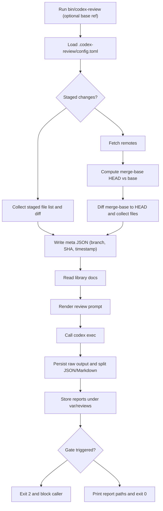

# Codex Review Agent Flow

The diagram below shows how the current Codex review runner orchestrates a review when `bin/codex-review` is invoked.

## Key Notes
- The runner reads `.codex-review/config.toml` and bundled guidance documents to inject reviewer expectations into the prompt.
- Staged changes are reviewed directly. Otherwise it fetches remotes, enforces a valid `git merge-base`, and builds diffs relative to the configured base branch.
- The assembled diff, metadata, and library excerpts are combined with `.codex-review/templates/review.exec.md` before invoking `codex exec`.
- Raw model output plus parsed Markdown/JSON reports are saved under `var/` for traceability.
- Priority/severity checks enforce policy before returning control to invoking hooks such as the pre-push script.

Update this document whenever the pipeline changes to keep reviewers aligned on the execution path.
